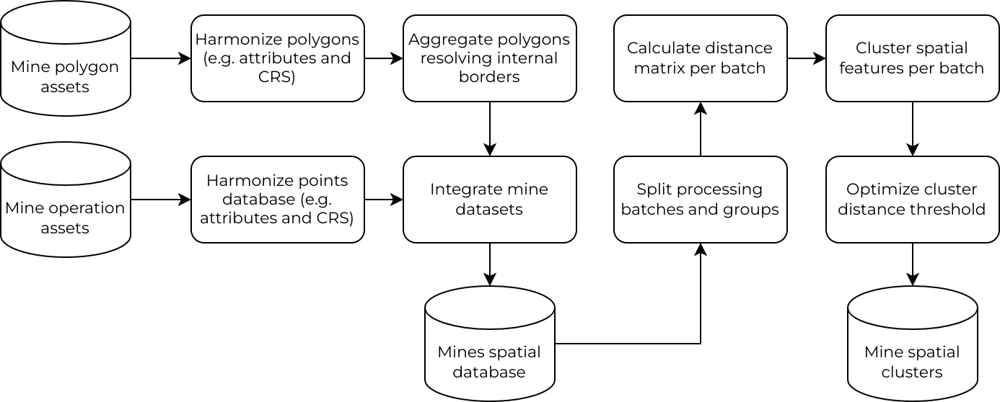

[](https://doi.org/10.5281/zenodo.15611393)

# Mining Spatial Data Integration and Optimization

This repository contains the R scripts to reproduce the data integration and spatial clustering optimization described in the paper "A data-driven approach to mapping global commodity-specific mining land-use".

The workflow ingests multiple global-scale mining datasets (both polygon land use and point-based properties), integrates them, and applies a novel optimization algorithm to cluster related features. The algorithm identifies the optimal clustering distance by building a "local" sensitivity curve and finding the Pareto optimal point that best minimizes both unassigned area and multi-commodity cluster assignments.


## Workflow Overview




## 1. System Requirements

### Software
* **R**: A modern version of R (e.g., 4.0 or newer).
* **R Packages**: All required R packages are managed by the `renv` package. The `renv.lock` file in this repository lists all dependencies and their exact versions. 
* **Operating System**: **Linux or macOS is required.** The parallel processing in `01-cluster-spatial-features.R` uses `type = "FORK"`, which is not available on Windows.

### Hardware
* **CPU**: A multi-core processor (8+ cores) is highly recommended. The distance matrix and clustering steps are computationally intensive and parallelized.
* **RAM**: A minimum of 16 GB of RAM is recommended. Integrating and processing the global spatial datasets (especially the graph-building in `00-integrate-available-data.R`) can be memory-intensive.

---

## 2. Installation Guide

This project uses `renv` to ensure full reproducibility.

1.  Clone this repository:
    ```bash
    git clone https://github.com/vwmaus/mining-spatial-data-integration.git
    cd mining-spatial-data-integration
    ```
2.  In the R console, restore the environment using `renv`:
    ```r
    renv::restore()
    ```
    This will install all R packages at their exact required versions, as specified in `renv.lock`.

* **Typical Install Time**: 5-15 minutes, depending on whether binary packages are available for your system (spatial packages like `sf` can take time to compile).

---

## 3. Data Requirements

This workflow automatically downloads most of the required public datasets (Maus, Tang, Jasansky, GEM). However, **two datasets must be provided manually** and placed in the `./tmp/` folder due to their licensing or distribution:

* `./tmp/osm/osm_quarry_check_20211125.gpkg`: The OpenStreetMap mining polygon data.
* `./tmp/snl2020.gpkg`: The S&P (SNL) mining properties point data.


---

## 4. Demo & Reproduction Instructions

To run the demo (which reproduces the results from the manuscript), simply execute the R scripts in sequential order *after* meeting the data requirements above.

**Important:** The full process is computationally intensive and will take several hours to run from scratch.

### Step 1: Integrate Data & Pre-Group Features
* **Run**: `Rscript 00-integrate-available-data.R`
* **What it does**: Integrates all source data (Maus, Tang, OSM, Jasansky, S&P, GEM) and builds a spatial graph to identify all connected components (`id_group`) and create processing batches.
* **Expected Output**: `./tmp/cluster_data.gpkg`
* **Expected Run Time**: 10 minutes (depending on graph processing).

### Step 2: Pre-calculate All Cluster Scenarios
* **Run**: `Rscript 01-cluster-spatial-features.R`
* **What it does**: This is the heaviest computational step. It runs in parallel to calculate distance matrices and perform hierarchical clustering *for every* pre-group at *every* distance threshold (1-20 km).
* **Expected Output**: `./tmp/hcluster_concordance.csv`
* **Expected Run Time**: 1+ hours (highly dependent on the number of CPU cores).

### Step 3: Run Optimization & Export Final Data
* **Run**: `Rscript 02-find-optimal-threshold.R`
* **What it does**: Analyzes the concordance table from Step 2. It performs the local meta-optimization (this is cached), identifies the single best clustering strategy, and generates the final data release.
* **Expected Output**: Final clustered data in `./output/<date>-all_materials/` (e.g., `cluster_features.gpkg`) and key optimization figures (e.g., `fig-sensitivity-analysis-local-threshold.png`).
* **Expected Run Time**: 20-30 minutes for the *first run*. Subsequent runs will be very fast (1-2 minutes) as the main sensitivity analysis is cached to `./tmp/sensitivity_analysis_cache.rds`.

### Step 4: Validate Results & Generate Figures
* **Run**: `Rscript 03-validate-cluster-results.R`
* **What it does**: Downloads the Werner et al. (2020) validation dataset and compares it against the generated clusters, producing a LaTeX table of similarity scores.
* **Expected Output**: `./output/.../tbl-similarity-metrics.tex`
* **Expected Run Time**: 20 minutes

* **Run**: `Rscript 04-cluster-extenssions-and-overview.R`
* **What it does**: Enriches the final clusters with country/ecoregion data and generates the final overview tables and figures for the manuscript.
* **Expected Output**: Additional figures and tables in `./output/.../`
* **Expected Run Time**: 1-2 minutes

* **Run**: `Rscript 05-cluster-progression-illustration.R`
* **What it does**: Generates an illustration of the clustering progress with the increasing threshold distance.
* **Expected Output**: Additional figures in `./output/.../`
* **Expected Run Time**: 1-2 minutes

---

## 5. Instructions for Use (On Your Data)

This workflow is designed to be run on custom data, provided you format your input to match the file generated by `00-integrate-available-data.R`.

1.  **Prepare Your Data**: Create a GeoPackage file and save it as `./tmp/cluster_data.gpkg`. This file **must** have the following schema:
    * `id` (character): A unique ID for every feature (e.g., "A000001", "P000001"). IDs stating with "A" refer to area (polygons) and with "P" to mine property (points).
    * `id_group` (integer): A component ID linking all features within a spatial proximity (this is the "pre-grouping" step).
    * `id_batch` (integer): A batch ID for parallel processing. You can group smaller `id_group`s into batches or assign a unique batch ID to very large groups.
    * `primary_commodity` (character): A string for the primary commodity (e.g., "Gold").
    * `commodities_list` (character): A comma-separated string of all commodities (e.g., "Gold,Silver,Copper").
    * `area_mine` (numeric): The area of the feature (e.g., in m²). Use `0` for point features.
    * `geom`: The `sf` geometry column (points or polygons).

2.  **Run Clustering**: Run `Rscript 01-cluster-spatial-features.R` as-is. It will use your custom `cluster_data.gpkg`.

3.  **Run Optimization**:
    * Run `Rscript 02-find-optimal-threshold.R`.
    * **To tune the optimization**, you can modify the parameters at the top of this script:
        * `user_defined_max_local_threshold`: Set this to a number (e.g., `7`) to *force* a specific max threshold and skip the meta-optimization. Leave as `NULL` (default) to find the optimum automatically.
        * `sensitivity_range_km`: Adjust the range of thresholds to test (e.g., `seq(1, 40, 2)`).
        * `force_rerun_sensitivity`: Set to `TRUE` to delete the cache and re-run the meta-optimization.

## 6. Citation

Victor Maus. A Data-Driven Approach to Mapping Global Commodity-Specific Mining Land-Use (June 17, 2025). Available at SSRN: [https://ssrn.com/abstract=5408302](https://ssrn.com/abstract=5408302) or [http://dx.doi.org/10.2139/ssrn.5408302](http://dx.doi.org/10.2139/ssrn.5408302).

## 7. License

This project is licensed under the GPL-3.0 License.
